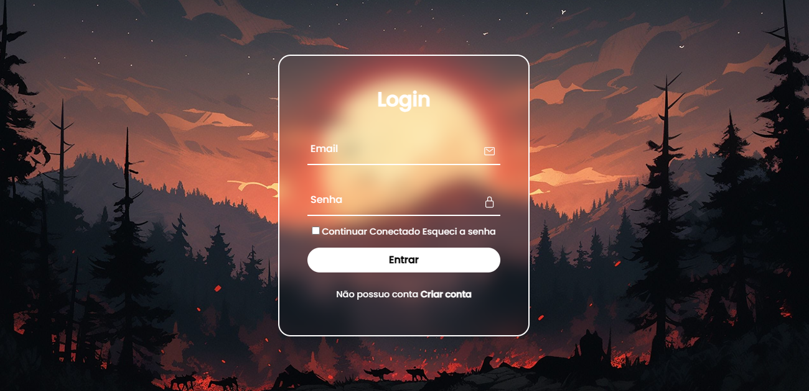

<h1 align="center"> Log in </h1>

Uma tela de Log in que além de bonita e responsiva, torna-se funcional, aplicando JS  

  <a href="#-tecnologias">Tecnologias</a>&nbsp;&nbsp;&nbsp;|&nbsp;&nbsp;&nbsp;
  <a href="#-projeto">Projeto</a>&nbsp;&nbsp;&nbsp;|&nbsp;&nbsp;&nbsp;

  

 

## 🚀 Tecnologias

Esse projeto foi desenvolvido com as seguintes tecnologias:

- HTML, CSS e JavaScript
- Git e Github

## 💻 Projeto

Esse belo Log in, foi criado com o intuito de ser utilizado futuramente em algum projeto de site, otimizando meu tempo!

- [Acesse o projeto finalizado, online](https://gb-rodrigues7.github.io/Log-in/)

